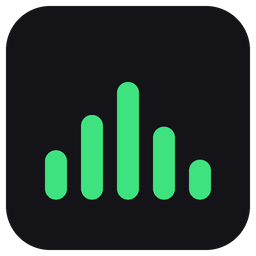
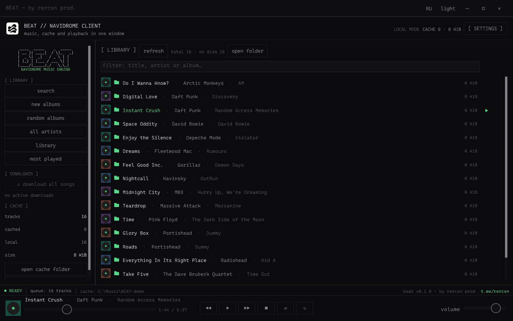
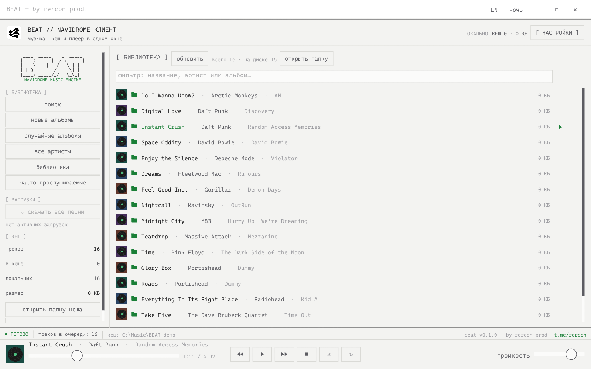

<p align="center"></p>

<h1 align="center">BEAT</h1>

<p align="center"><strong>A lightweight Windows player for Navidrome and your own music.<br>Streams and automatically caches music from Navidrome for offline listening.</strong></p>

<p align="center">
<a href="https://github.com/RERCON0/BEAT/actions/workflows/ci.yml"></a>
<a href="https://github.com/RERCON0/BEAT/actions/workflows/security.yml"></a>
<a href="#build"></a>
<a href="https://t.me/rercon"></a>
</p>

<p align="center">
<a href="README.md">English</a> · <a href="README.ru.md">Русский</a><br>
<a href="https://github.com/RERCON0/BEAT/releases/latest">Download</a> · <a href="#features">Features</a> · <a href="#quick-start">Quick start</a> · <a href="#build">Build</a> ·
<a href="#settings-and-data">Data</a> · <a href="docs/REFERENCE.md">Reference (RU)</a>
</p>

BEAT is a lightweight native Windows application written in Rust.
Connect [Navidrome](https://www.navidrome.org/) or add your music folders.
Downloaded tracks remain ordinary files; local playback works without a server.



<details>
<summary>Light theme</summary>

</details>

*Screenshots use demo track names and original placeholder artwork. No audio files are included. Both themes support EN/RU.*

## Features

| | What BEAT does |
|---|---|
| **Lightweight** | Native Rust application with bundled fonts and codecs; runs as a single portable EXE |
| **Automatic Navidrome caching** | Tracks are saved in the background as they play; finished downloads remain available offline. Enable automatic caching of new server songs to save future additions too |
| **One library** | Server songs, cached downloads and up to 16 local folders in one list; instant title, artist and album filter |
| **Browse and search** | Artists, albums, embedded artwork and search across the server and local music |
| **Playback queue** | Open from the status bar; play a selected track, reorder or remove entries, or keep only the current track |
| **Ready for the next song** | Prepares the next local or fully cached track for a gapless transition; predownloads the next server track within the download limit |
| **Windows controls** | System media controls and compatible keyboard/headset play, pause, previous and next buttons, including while minimized |
| **Pick up where you left off** | Restores the last track, its position, queue, shuffle and repeat; playback starts when you press **▶** |
| **Downloads** | A track, album or the whole library; up to three downloads at once; optional automatic caching of new songs |
| **Offline and bilingual** | Your files and finished downloads work without a server; dark/light themes and a saved EN/RU switch in the title bar |
| **Defensive handling** | Windows DPAPI for passwords, account separation, restricted redirects and paths, bounded media/cover parsing; CI and security checks |

MP3, FLAC, OGG/Vorbis, **Opus** (mono/stereo in Ogg/WebM), WAV and common
AAC/M4A/MP4 variants are supported. Opus is bundled. Streaming starts after
buffering; seeking during download is limited to the data already received.

> [!IMPORTANT]
> Gapless playback needs the next file to be ready in time. A slow server or
> an unfinished download can still require buffering. Silence already present
> in the recording is preserved.

## Quick start

### With Navidrome

1. Open **Settings**, enter the server address, username and password.
2. Select **Test connection**, then **Save**.
3. Open the library, an album or search. **▶** plays; **↓** downloads.

The address may include a subfolder, such as `https://music.example.com/library`;
do not append `/rest`. Remote servers require HTTPS; HTTP is allowed only for
`localhost` and loopback addresses.

> [!TIP]
> Automatic caching first remembers the existing songs, then downloads new
> additions. To fetch the whole library now, select **↓ download all songs**.
> Tracks already downloaded are skipped.

### With your music

1. Open **Settings** and add your music folders. Files stay in their original locations.
2. Open **Library** and select **Refresh** if needed. Subfolders are included.
3. Press **▶**; click the queue count in the status bar to edit the playing list.

The cache defaults to the system **Music → BEAT** folder and can be changed.
You can also place your own files there. Local files are never uploaded to
Navidrome; clearing the cache affects only BEAT's indexed downloads.

Use **RU / EN** in the title bar to switch language and **light / dark** to
switch theme. Both choices persist across restarts.

## Build

Target: **Windows x64**. Install Rustup, Visual Studio Build Tools with C++
and the Windows SDK, and CMake 3.16+ for bundled libopus. Running BEAT needs
OpenGL 2.1+ and an audio output device. Rust is pinned in
[rust-toolchain.toml](rust-toolchain.toml).

From the repository root in PowerShell:

```powershell
cargo build --locked --release --bin beat
.\target\release\beat.exe
```

A server or music library is not required to build. The icon, fonts and Opus
decoder are bundled; launch the EXE from Explorer. MSVC is linked statically,
so Visual C++ Redistributable is not required.

> [!NOTE]
> Builds do not currently have an Authenticode signature. SmartScreen may
> warn about an unknown app. If you trust the build's source, choose
> **More info → Run anyway**. A SHA-256 hash alone does not identify the publisher.

## Settings and data

| Location | Contents |
|---|---|
| `%APPDATA%\beat` | Settings, language, last track and position, queue, play counts and server lists |
| `%APPDATA%\beat\covers` | Bounded thumbnail cache |
| **Music → BEAT** or your chosen cache folder | Downloads and separate `.beat-index-*.json` files |
| Additional music folders | Your original audio files; BEAT reads them in place |

Passwords use Windows DPAPI for the current user. Downloads, server lists and
covers are scoped to the server/account; history and sessions also account for
the cache folder. Old account files remain accessible as local music. Clearing
the cache deletes only the current account's indexed downloads. Removing a
music folder from Settings does not delete its files. Damaged state files are
preserved for recovery; read/write failures are visible.

> [!CAUTION]
> Inspect or remove unfinished `*.part` files left by a crash only while BEAT
> is closed. Do not share your account settings or server password.

## Development

```powershell
cargo fmt --all -- --check
cargo clippy --locked --all-targets -- -D warnings
cargo test --locked --all-targets
python -B scripts/check_docs.py
python -B scripts/update_i18n.py --check
```

CI checks code, translations, documentation and the optimized Windows build.
Security checks Cargo.lock daily and scans the entire Git history for secrets.
Actions use full commit pins; Dependabot proposes weekly updates. CI artifacts
include the unsigned EXE, SHA-256, source revision and component notices.

- [Reference (RU)](docs/REFERENCE.md) — queue, streaming, caching and project structure.
- [Security (RU)](SECURITY.md) — protection boundaries and dependency warnings.
- [Audit before publication (RU)](docs/AUDIT-2026-10-07.md) — fixes and verification.
- [Icon](icons/README.md) · [Cascadia Mono notice](fonts/OFL-notice.txt) and [license](fonts/OFL.txt).
- [Bundled audio and Windows components](third_party/README.md) — sources and licenses.

rercon prod. · [Telegram](https://t.me/rercon)