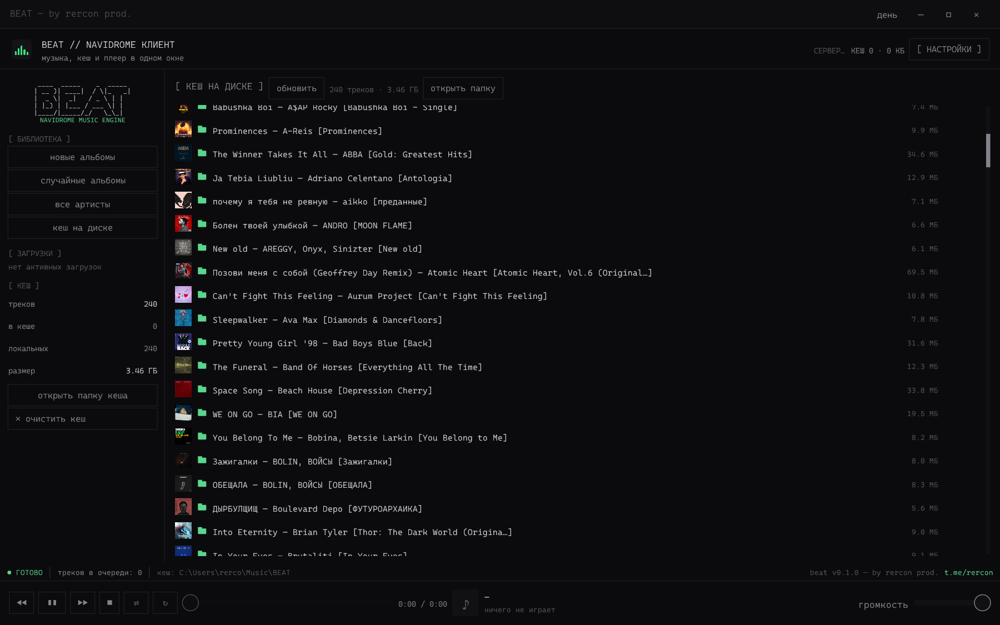

# BEAT

**BEAT** — компактный настольный плеер для [Navidrome](https://www.navidrome.org/)
и локальной музыки. Клиент написан на Rust, использует Subsonic API и хранит
скачанные треки обычными файлами. Одно окно, потоковое воспроизведение и
офлайн-кеш без браузера и Electron. Автор — rercon prod.



*Скриншот: раздел «Кеш на диске» с локальной музыкой, обложками и плеером.*

## Возможности

| Раздел | Что доступно |
| --- | --- |
| Библиотека | Новые и случайные альбомы, артисты, альбомы артиста, поиск по артистам, альбомам и трекам; обложки. |
| Воспроизведение | Пауза, следующий/предыдущий трек, перемотка, громкость, перемешивание, повтор списка или одного трека. Очередь формируется из альбома либо списка файлов на диске. |
| Загрузка | Отдельный трек, альбом или всю библиотеку; автокеширование новых песен, очередь, от 1 до 3 одновременных загрузок и прогресс в боковой панели. |
| Офлайн | Прослушивание скачанного без сети и добавленных вручную файлов без сервера. |
| Интерфейс | Светлая и тёмная темы, Cascadia Mono, встроенная иконка, компактное окно без Electron. |

## Требования и сборка

Основная платформа — **Windows**. Нужны установленный [Rust/Cargo](https://rustup.rs/)
с toolchain MSVC, рабочее устройство вывода звука и графический драйвер с
поддержкой OpenGL 2.1+. При сборке на Windows могут понадобиться компоненты
Visual Studio Build Tools / Windows SDK.

В корне проекта:

```powershell
cargo build --release --locked
```

Готовый файл: `target\release\beat.exe`. Запустите его из Проводника или
командой `.\target\release\beat.exe` в PowerShell. Компиляция не требует
работающего сервера Navidrome. Файлы из `target/` не добавляются в Git; после
клонирования проект нужно собрать локально.

### Подключение к Navidrome

1. Запустите BEAT и нажмите **[ НАСТРОЙКИ ]**.
2. Укажите базовый адрес сервера, например `https://music.example.com`, логин
   и пароль пользователя Navidrome. Если сервер расположен в подпапке, укажите
   её в адресе; дописывать `/rest` не нужно.
3. Нажмите **[ ПРОВЕРИТЬ СВЯЗЬ ]**, затем **[ СОХРАНИТЬ ]**.
4. Откройте новые или случайные альбомы, список артистов либо поиск. Кнопка
   **▶** запускает воспроизведение, **↓** скачивает трек или альбом.

В настройках можно включить **«автоматически кешировать новые песни»**.
При первом успешном полном обходе после включения BEAT **только запоминает уже
существующие песни** — они не начнут скачиваться без вашего выбора. Далее,
пока приложение открыто, библиотека проверяется примерно каждые 10 минут:
новые треки, в том числе добавленные в старые альбомы, ставятся в очередь
загрузок. При ошибке сети или неполном ответе сервера проверка повторяется и
неполный список не сохраняется; неудачная загрузка остаётся
кандидатом для следующего обхода. Настройка сохраняется после перезапуска.

Чтобы **сразу скачать все отсутствующие песни**, нажмите **«↓ скачать все
песни»** в разделе «Загрузки» боковой панели. Кнопка работает независимо от
переключателя автокеширования. BEAT обходит альбомы постранично в фоне,
пропускает уже скачанные файлы и постепенно наполняет очередь; одновременно
скачиваются не более выбранных 1–3 треков. Ход обхода виден в боковой панели.
Кнопка «остановить поиск» прекращает добавление следующих песен; уже
поставленные в очередь или запущенные загрузки завершаются как обычно.
Кнопка «очистить очередь» отменяет ожидающие загрузки и останавливает поиск;
активные докачиваются. Если автокеширование включено, нескачанные новые песни
снова найдутся при следующей проверке.
Если закрыть приложение до окончания загрузки всей библиотеки, после нового
запуска нажмите кнопку ещё раз — уже скачанные треки будут пропущены.

Для удалённого сервера нужен **HTTPS**. Незашифрованный HTTP принимается
только для `localhost` и loopback-адресов (`127.0.0.1`, `[::1]`). Если сервер
перенаправляет запросы на другой хост или порт, укажите в настройках уже
конечный адрес.

### Без сервера: локальная музыка

1. В боковой панели нажмите **«открыть папку кеша»** или посмотрите путь в
   строке состояния. По умолчанию это системная папка «Музыка» → `BEAT`;
   путь можно изменить в настройках.
2. Скопируйте туда свои файлы, в том числе в подпапки.
3. Откройте **«кеш на диске»** и при необходимости нажмите **«обновить»**.

Локальные файлы отмечены значком папки, воспроизводятся непосредственно с
диска и не отправляются на сервер. Поддерживаются MP3, FLAC, OGG/Vorbis,
WAV и распространённые варианты AAC/M4A/MP4; отдельные файлы `.opus` не
включены в локальный список. Название, исполнитель и альбом читаются из тегов,
длительность определяется по параметрам аудиофайла. Если тегов нет, BEAT
разбирает имя вроде `Artist - Title.mp3` или `01 - Title.flac`. Обложка берётся
из метаданных файла, если она есть. Ссылки на каталоги и файлы при сканировании
не обходятся.

В списке локальной музыки BEAT ничего не переименовывает и не удаляет:
кнопка **«очистить кеш»** затрагивает только файлы, записанные в индекс как
загрузки самого приложения.

## Как работают поток и кеш

При первом воспроизведении трек начинает играть после получения буфера;
остаток загружается в фоне. Поток записывается в файл `*.part`, а плеер читает
уже полученные байты из этого же файла. Перемотка во время загрузки доступна
только в пределах скачанной части. После окончания файл переименовывается в
готовый и добавляется в индекс. Повторно скачивать готовый трек не требуется.

Скачанные файлы лежат в выбранной папке в виде
`Артист/Альбом/NN - Название.ext`. Имена нормализуются для Windows; при
совпадении используется суффикс ` (2)`. Индекс `.beat-index.json` хранится
рядом с файлами. В разделе «кеш на диске» можно обновить список, открыть
папку, удалить отдельный скачанный трек или очистить скачанный кеш. Загрузка
одного трека ограничена **2 ГБ**.

В настройках доступны исходный формат (`оригинал`) и серверное
транскодирование в MP3 с настраиваемым битрейтом. Изменить сервер, формат или
папку кеша во время активной загрузки нельзя: дождитесь её завершения и
нажмите «сохранить» повторно.

| Данные | Расположение на Windows |
| --- | --- |
| Настройки | `%APPDATA%\beat\config.json` |
| Известные песни для автокеширования | `%APPDATA%\beat\catalog-<ключ сервера и пользователя>.json` |
| Музыка и индекс | Системная папка «Музыка» → `BEAT` либо каталог, выбранный в настройках |
| Сборка | `target\release\beat.exe` |

Настройки и музыкальные файлы не нужны для сборки и не должны попадать в
репозиторий. Папка `target/`, локальные каталоги `cache/` и `music/` в корне
проекта, индекс, файлы `*.part` и `.env` исключены через `.gitignore`.

## Безопасность и восстановление

- На Windows пароль в файле настроек защищён DPAPI для текущего пользователя.
  Subsonic API получает токен `MD5(пароль + случайная соль)` и соль, а не сам
  пароль в адресе запроса; это схема аутентификации протокола, а не способ
  хранения паролей на сервере.
- Ответы API и обложки ограничены по размеру. Переходы на другой хост,
  протокол или порт не следуют за запросами с токеном.
- Пути из индекса проверяются перед чтением и удалением: выход из папки кеша,
  служебные файлы, симлинки и Windows junction отклоняются.
- Если индекс повреждён, он сохраняется как `.beat-index.corrupt-*.bak`, а в
  приложении появляется сообщение. Если файл не удалось сохранить в резервную
  копию, запись нового индекса блокируется во избежание потери данных.
- Если файл нельзя удалить (например, он занят), запись о нём остаётся в
  индексе. Второй экземпляр приложения в том же сеансе Windows не запускается,
  чтобы два процесса не изменяли индекс одновременно.
- Список известных треков отдельный для каждого сервера и пользователя.
  Повреждённый файл этого списка не перезаписывается автоматически: ошибка
  показывается в приложении, а старый файл остаётся доступен для восстановления.

После аварийного закрытия в папке могут остаться незавершённые `*.part`.
Проверяйте и удаляйте их вручную **только при закрытом BEAT**. Если пропала
связь с сервером, ранее скачанные треки и локальные файлы остаются доступны.

## Проверка и структура проекта

```powershell
cargo test --locked
cargo clippy --locked --all-targets -- -D warnings
```

| Путь | Назначение |
| --- | --- |
| `src/main.rs` | Окно, очередь, обработка событий, интерфейс и управление воспроизведением. |
| `src/api.rs` | Клиент Subsonic API, запросы к Navidrome и проверка адресов. |
| `src/cache.rs` | Индекс, безопасные пути, загрузки и чтение растущего файла. |
| `src/catalog.rs` | Постраничный обход библиотеки, запоминание существующих песен и поиск новых. |
| `src/local.rs` | Поиск локальной музыки, чтение тегов и обложек. |
| `src/player.rs` | Аудиовывод, декодирование и перемотка. |
| `src/config.rs` | Настройки, расположение данных и защита пароля на Windows. |
| `src/theme.rs`, `src/banner.rs` | Внешний вид и оформление. |
| `icons/`, `fonts/` | Иконка приложения и встроенный шрифт. |

Иконка для исполняемого файла собирается из `icons/beat.ico` через `build.rs`.
Пересоздать файлы иконки можно командой `cargo run --example gen_icons`.
Встроенный Cascadia Mono распространяется по SIL Open Font License 1.1;
подробности — в [`fonts/OFL-notice.txt`](fonts/OFL-notice.txt).
